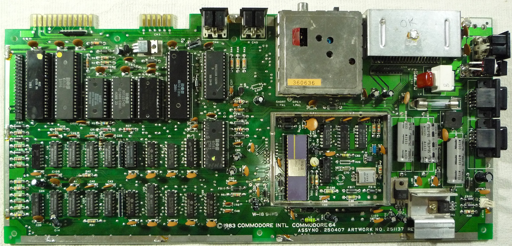

## C++ Training Program: Leverage Our 15+ Years of Expertise in Embedded Systems

**Empower yourself with industry-proven C++ development skills**

Elevate your programming capabilities with our C++ training program, meticulously crafted by a team with over 15 years of experience in building C++ microservices for embedded systems. We leverage continuous integration (CI) best practices to ensure our training reflects the latest industry standards.

**Course Outline:**

* Introduction to C++
* Types, Classes, and Objects (Part 1 & 2)
* Templates
* Smart Pointers and Move Semantics
* Functional Programming Features
* Threading and Time Management
* Miscellaneous Topics

**Why Choose Our C++ Training?**

* **Industry-Leading Expertise:** Benefit from over 15 years of experience in building C++ microservices for embedded systems.
* **Focus on CI Best Practices:** Integrate CI principles throughout the curriculum, ensuring your code is well-tested and maintainable.
* **Real-World Applications:** Learn from practical examples and case studies relevant to microservice development in embedded systems.
* **Expert Instructors:** Our trainers are passionate C++ developers with extensive experience in embedded systems programming.

**Invest in Your Future**

C++ is a vital skill for developers working on embedded systems and microservices. Our C++ training program empowers you to:

* Build robust and efficient C++ microservices
* Contribute to cutting-edge embedded systems projects
* Stay ahead of the curve with the latest CI best practices

**Pricing and Training Options**

The cost of this C++ training program can vary depending on several factors, including:

* **Training Format:**
    * In-person classes tend to be more expensive than online courses.
    * Blended learning might fall somewhere in between.
* **Course Duration and Depth:** Longer and more in-depth courses will likely cost more.
* **Location:** Training prices can vary depending on the geographic location.

Here's a possible pricing range to give you an idea:

* Low-end: $1,000 - $2,000 USD (shorter online course)
* Mid-range: $3,000 - $5,000 USD (typical range for in-person or blended learning)
* High-end: $5,000+ USD (very intensive program from a highly reputable provider)

**We offer a variety of training options to suit your needs, including:**

* In-Person Classes: Immerse yourself in a collaborative learning environment.
* Online Training: Learn from the comfort of your own pace with our interactive online platform.
* Blended Learning: Combine in-person and online sessions for a well-rounded learning experience.

**Contact us today to discuss your C++ training goals and explore our program options!** We'll help you leverage our experience and best practices to become a proficient C++ developer for embedded systems.

**Call to Action:**

* Enroll in our industry-proven C++ training program!
* Download our course syllabus tailored to embedded systems development.
* Speak with an advisor to learn how our CI-focused training can benefit you.

